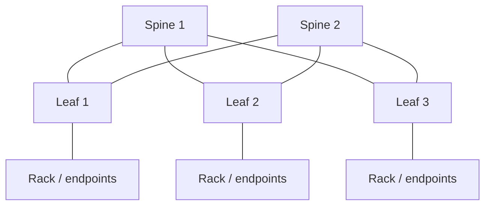
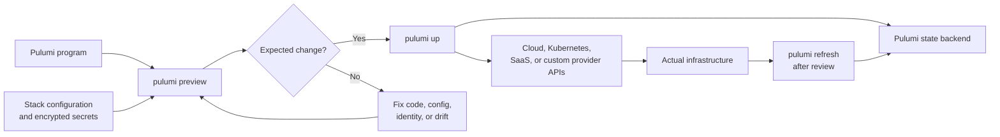
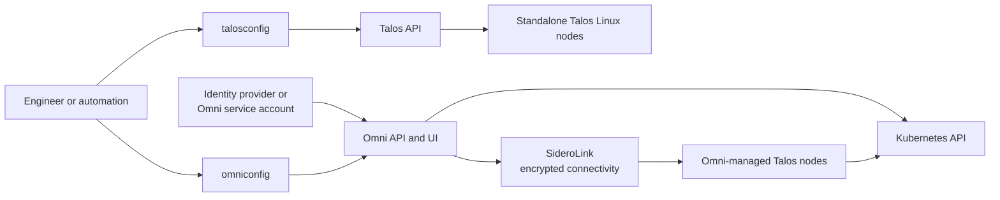
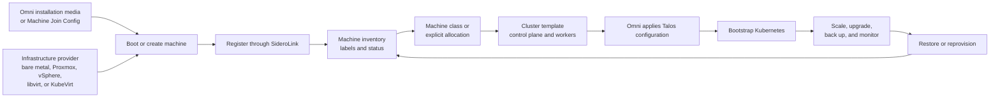
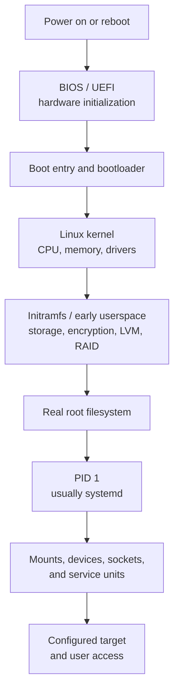
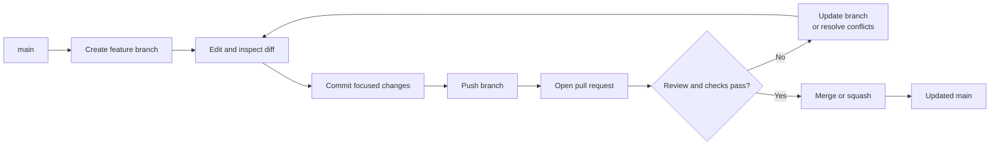
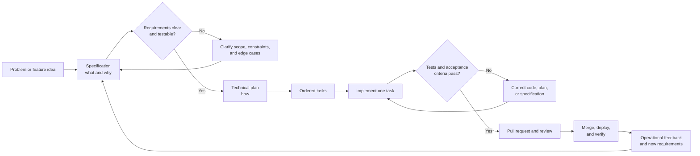
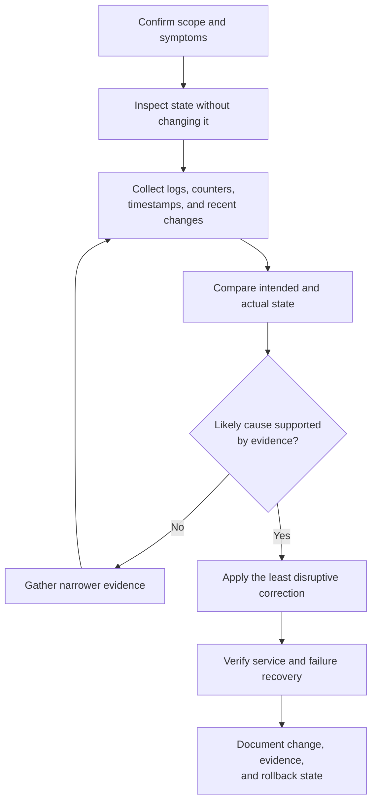

# Infrastructure Visual Guides

> **Applies to:** General infrastructure and network engineering concepts
> **Last reviewed:** 2026-07-18

These Mermaid diagrams supplement the detailed references with quick topology, lifecycle, and troubleshooting views. They are intentionally conceptual: use the linked pages for commands, platform differences, safety warnings, and implementation details.

The collection is deliberately limited to concepts where visual relationships improve comprehension. Command-oriented cloud, CLI, and utility references remain text-first rather than receiving decorative diagrams.

## Spanning tree: root and alternate path

Related reference: [networking/spanning-tree.md](networking/spanning-tree.md)

In a redundant Layer 2 triangle, spanning tree elects a root bridge and keeps one redundant path from forwarding. The alternate path can transition to forwarding after a topology failure.

```mermaid
flowchart TB
    Root["SW1<br/>Root bridge"]
    SW2["SW2<br/>Root port toward SW1"]
    SW3["SW3<br/>Root port toward SW1"]
    UsersA["Access devices"]
    UsersB["Access devices"]

    Root ---|"Designated / forwarding"| SW2
    Root ---|"Designated / forwarding"| SW3
    SW2 -. "Alternate / discarding on one side" .- SW3
    SW2 --- UsersA
    SW3 --- UsersB
```

The exact blocked side depends on root-path cost and bridge or port tie-breakers. The diagram does not imply that the same physical port always blocks.

## Leaf-spine fabric

Related reference: [networking/leaf-spine.md](networking/leaf-spine.md)

Every leaf connects to every spine. Traffic between endpoints on different leaves normally uses one spine hop, providing predictable path length and multiple equal-cost routes.

A healthy routed fabric normally loses capacity rather than reachability when one spine fails, assuming every leaf still has another working spine path.

## Pulumi change lifecycle

Related reference: [automation/pulumi.md](automation/pulumi.md)

Pulumi evaluates program code and stack configuration, previews the proposed change, applies approved changes through provider APIs, and records resource state in the selected backend.

A preview is not a substitute for validating the selected stack, cloud identity, region, policy controls, and rollback plan.

## Talos and Omni management boundary

Related references: [kubernetes-platforms/talos-linux.md](kubernetes-platforms/talos-linux.md) and [kubernetes-platforms/omni.md](kubernetes-platforms/omni.md)

Standalone Talos is managed directly through the Talos API. When a machine joins Omni, Omni becomes the management authority and brokers normal Talos and Kubernetes access through its identity and policy model.

The two paths are intentionally different. Direct standalone procedures should not be assumed to work unchanged on an Omni-managed machine.

## Omni machine-to-cluster lifecycle

Related reference: [kubernetes-platforms/omni.md](kubernetes-platforms/omni.md)

Omni can register manually provisioned machines or obtain machines through infrastructure providers, then allocate them to a cluster and manage their Talos and Kubernetes lifecycle.

Out-of-band deletion of provider-managed or control-plane machines can leave Omni waiting for resources that no longer exist and can break etcd quorum.

## Linux boot sequence

Related reference: [linux/linux-boot.md](linux/linux-boot.md)

The boot process moves from firmware into the bootloader, kernel, early userspace, PID 1, and finally normal services and login targets.

A failure should be investigated at the earliest incomplete stage: firmware entry, bootloader, kernel, initramfs, root filesystem, or userspace service activation.

## Git branch and pull-request workflow

Related reference: [development/git.md](development/git.md)

A small branch-based workflow keeps changes isolated, reviewable, and recoverable before they reach the shared default branch.

Use `git status`, staged and unstaged diffs, and a backup branch before destructive history repair.

## Spec-driven development lifecycle

Related reference: [development/spec-driven-development.md](development/spec-driven-development.md)

Spec-driven development separates expected behavior from technical design, breaks the design into verifiable tasks, and checks the completed implementation against the original acceptance criteria.

The diagram is conceptual. A small low-risk change may combine stages, while a production or regulated change may require additional security, architecture, migration, and approval gates.

## Operational troubleshooting sequence

Related guidance: [../STYLE_GUIDE.md](../STYLE_GUIDE.md)

This sequence is reusable across network, Linux, cloud, and infrastructure-automation troubleshooting.

Avoid using a diagram merely to restate a flat command list. Mermaid is most valuable for relationships, paths, decisions, state transitions, and failure domains.
