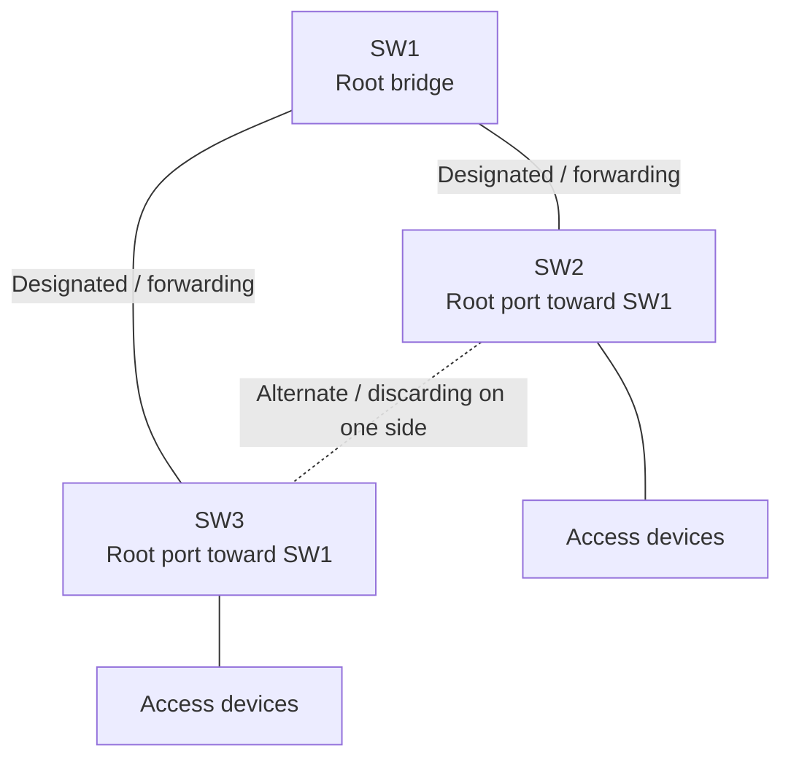
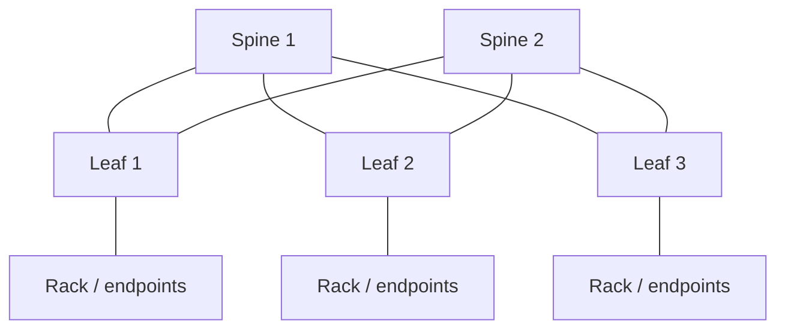
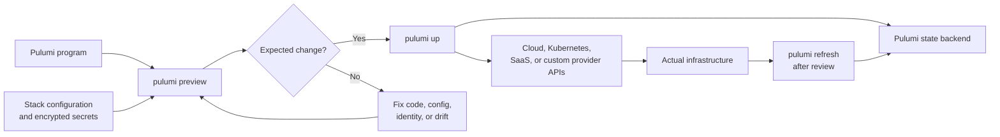
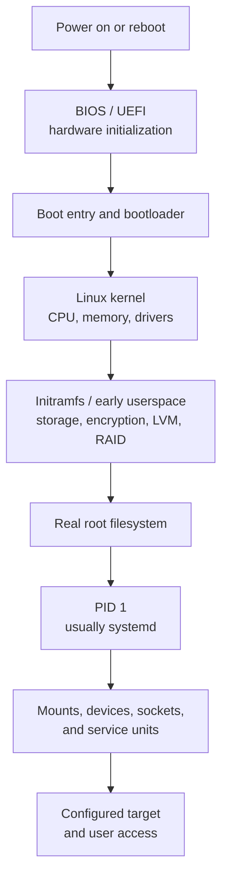
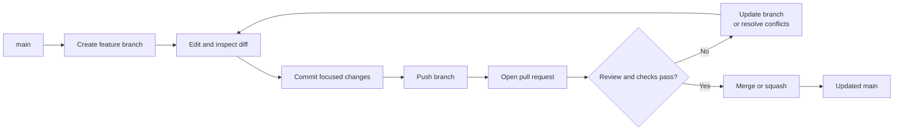
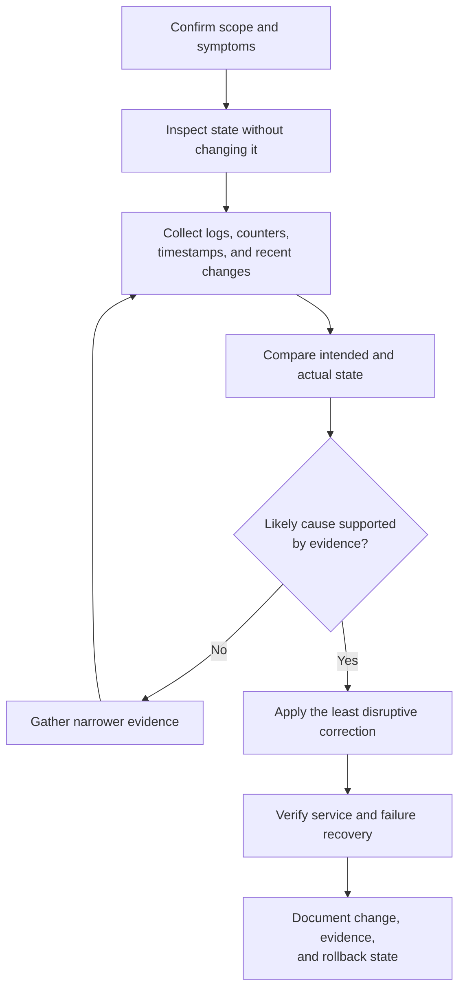

# Infrastructure Visual Guides

> **Applies to:** General infrastructure and network engineering concepts
> **Last reviewed:** 2026-07-14

These Mermaid diagrams supplement the detailed cheat sheets with quick topology, lifecycle, and troubleshooting views. They are intentionally conceptual: use the linked reference pages for commands, platform differences, safety warnings, and implementation details.

The collection is deliberately limited to concepts where visual relationships improve comprehension. Command-oriented cloud, CLI, and utility references remain text-first rather than receiving decorative diagrams.

## Spanning tree: root and alternate path

Related reference: [spanning-tree.md](spanning-tree.md)

In a redundant Layer 2 triangle, spanning tree elects a root bridge and keeps one redundant path from forwarding. The alternate path can transition to forwarding after a topology failure.

The exact blocked side depends on root-path cost and bridge or port tie-breakers. The diagram does not imply that the same physical port always blocks.

## Leaf-spine fabric

Related reference: [leaf-spine.md](leaf-spine.md)

Every leaf connects to every spine. Traffic between endpoints on different leaves normally uses one spine hop, providing predictable path length and multiple equal-cost routes.

A healthy routed fabric normally loses capacity rather than reachability when one spine fails, assuming every leaf still has another working spine path.

## Pulumi change lifecycle

Related reference: [pulumi.md](pulumi.md)

Pulumi evaluates program code and stack configuration, previews the proposed change, applies approved changes through provider APIs, and records resource state in the selected backend.

A preview is not a substitute for validating the selected stack, cloud identity, region, policy controls, and rollback plan.

## Linux boot sequence

Related reference: [linux-boot.md](linux-boot.md)

The boot process moves from firmware into the bootloader, kernel, early userspace, PID 1, and finally normal services and login targets.

A failure should be investigated at the earliest incomplete stage: firmware entry, bootloader, kernel, initramfs, root filesystem, or userspace service activation.

## Git branch and pull-request workflow

Related reference: [git.md](git.md)

A small branch-based workflow keeps changes isolated, reviewable, and recoverable before they reach the shared default branch.

Use `git status`, staged and unstaged diffs, and a backup branch before destructive history repair.

## Operational troubleshooting sequence

Related guidance: [STYLE_GUIDE.md](STYLE_GUIDE.md)

This sequence is reusable across network, Linux, cloud, and infrastructure-as-code troubleshooting.

Avoid using a diagram merely to restate a flat command list. Mermaid is most valuable for relationships, paths, decisions, state transitions, and failure domains.